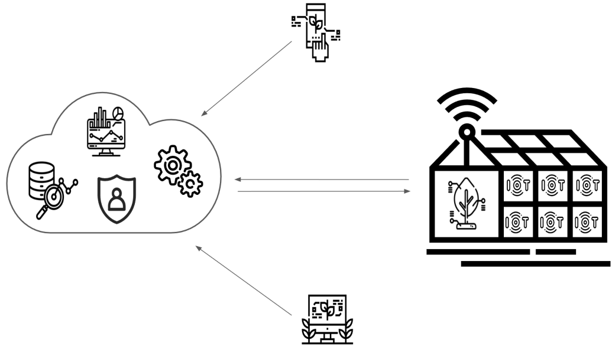

---


**EnviroSense 🌱📡** es un sistema compuesto por cuatro nodos IoT dedicados al monitoreo ambiental, gestión de consumo eléctrico, análisis de soluciones nutritivas y control de actuadores en invernaderos.  
Cada nodo se conecta a una red Wi-Fi local y envía datos de sensores en tiempo real a **AWS IoT Core** mediante el protocolo **MQTT**.




---

## 🔗 Nodos IoT

### 🌿 Environmental Sensor
- Mide: temperatura, humedad, presión atmosférica, luminosidad y concentración de CO₂.
- **Sensores utilizados:** `BME280`, `BH1750`, `MH-Z19-C`.

### ⚡ Consumption Sensor
- Mide: consumo de energía eléctrica (tensión, corriente, potencia) y nivel (para control de nivel en los depósitos de los nutrientes).
- **Sensores utilizados:** `PZEM-004T`, `HC-SR04`.

### 💧 Nutrient Solution Sensor
- Mide: conductividad eléctrica (CE), pH, total de solidos disueltos (TDS) y temperatura de una solución nutritiva.
- **Sensores utilizados:** `TDS Sensor`, `pH Sensor`, `CE Sensor`,`DS18B20`.

### ⚙️ Actuator
- Controla: actuadores remotos como bombas, ventiladores o sistemas de riego.

- **Componentes utilizados:** `Relay de 4 canales 5V` y `Relay de 2 canales 5V`.

---

## 🗂️ Estructura del proyecto

```plaintext
actuator/
├── aws/
├── lib/
consumption-sensor/
├── aws/
├── lib/
environmental-sensor/
├── aws/
├── lib/
nutrient-solution-sensor/
├── aws/
├── lib/
```

Cada carpeta contiene:

- `main.py`: Script principal del firmware.
- `config.py`: Configuración general del dispositivo.
- `interval.conf`: Intervalo de muestreo de los datos.
- `timezone.conf`: Zona horaria configurada.
- `wifi.dat`: Credenciales de conexión Wi-Fi.
- `aws/`: Certificados y claves para conexión segura a AWS IoT Core.
- `lib/`: Librerías auxiliares específicas para sensores y funciones de red.

---

## 🛠️ Tecnologías utilizadas

- **Microcontroladores:** ESP32
- **Lenguaje:** MicroPython
- **Comunicación:** MQTT sobre TLS
- **Plataforma en la nube:** AWS IoT Core
- **Sensores:** 
  - BME280 (Temperatura, humedad, presión)
  - BH1750 (Luminosidad)
  - MH-Z19-C (CO₂)
  - PZEM-004T (Consumo eléctrico)
  - HC-SR04 (Distancia)
  - TDS Sensor (Conductividad eléctrica)
  - CE Sensor (Conductividad eléctrica)
  - pH Sensor (pH)
  - DS18B20 (Temperatura de líquidos)

---

## 🚀 Instalación y despliegue

1. **Cargar el firmware** de cada nodo en su respectivo dispositivo ESP32.
2. **Configurar** el archivo `wifi.dat` con las credenciales de la red Wi-Fi.
El nodo además genera un servidor web para configurar a través del mismo la configuración Wi-Fi.
3. **Editar** el archivo `config.py` con los parámetros específicos del dispositivo (código del sensor/actuador y endpoint, id del cliente y tópicos de AWS IoT Core).
4. **Agregar** los certificados de seguridad en el directorio `aws/`.
5. **Encender** los dispositivos.  
   Cada nodo se conectará automáticamente a la red Wi-Fi y comenzará a transmitir datos a AWS IoT Core mediante MQTT.

---

## 📦 Dependencias

Las librerías necesarias están incluidas en la carpeta `lib/` de cada nodo. Entre ellas:

- Librerías para sensores:
  - `bme280.py`
  - `bh1750.py`
  - `mhz19.py`
  - `pzem.py`
  - `ec.py`
  - `ph.py`
  - `tds_sensor.py`
  - `ds18b20.py`
- Librerías de red:
  - `wifi_manager.py`
  - `robust.py`
- Librerías adicionales:
  - `onewire.py`


---

## 👨‍💻 Autor

**Lic. Martín Lacheski**  
📡 Especialización en Internet de las Cosas (IoT)  
🏛️ Universidad de Buenos Aires (UBA)

---

## 📜 Licencia

Este proyecto se distribuye bajo la licencia **MIT**. Consulte la [LICENCIA](LICENSE) como referencia.